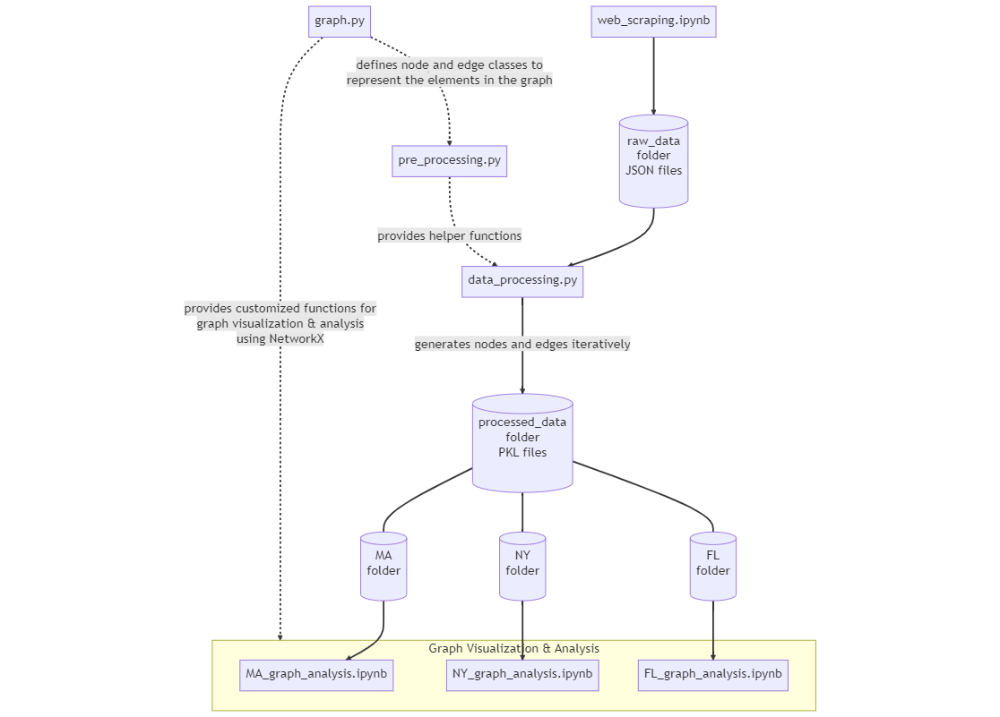

# Explainable Environment Influencers (EEI)

## Introduction

The goal of this project is to create a state-level network that reflects political influence related to environmental issues. The network will be analyzed and visualized to identify potential connections among entities, with the aim of informing future lobbying efforts.

To achieve this, the project has focused on constructing networks for three states: Massachusetts, Florida, and New York. The analysis process and results are documented in three Jupyter notebooks, one for each state: [MA_graph_analysis.ipynb](MA_graph_analysis.ipynb), [FL_graph_analysis.ipynb](FL_graph_analysis.ipynb), and [NY_graph_analysis.ipynb](NY_graph_analysis.ipynb).

Read on to learn more about the project.

## Workflow

## Data Source

The graph is built using data from Vote Smart, which provides information about politicians and their votes on bills, as well as their campaign donors and the interest groups that rate them. Additionally, we use data from Twitter, BillTrack50, and the Regional Economic Analysis Project to support the conclusions drawn by the graph model and to perform a more detailed analysis. By combining information from these various sources, we expect to gain a more comprehensive understanding of the political landscape and the factors that influence it.

## Graph Construction

To start modeling, we were given a list of state-level legislators and chose three politicians to focus on. Using an outcome-oriented approach, we created a network that shows the potential influence-to-decision process around environmental bills that these politicians had voted for. The network includes campaign donors, interest groups, policies, and other politicians, sourced from Vote Smart.

We made four iterations of the network, with each iteration adding new entities that were highlighted with a yellow background. The first iteration was the most basic model, and the fourth iteration was the most comprehensive, which we used for further analysis. Although we could have continued adding more entities to make the model even more accurate, we were constrained by time and computing power limitations.

- First Iteration 
    
- Second Iteration 
    
- Third Iteration 
    
- Fourth Iteration 
    

## Analysis Objectives

- Structural evolution in the process of graph construction
- Influence study using centrality metrics
- Sensitivity analysis of changes in graph structure
- Community detection using Louvain algorithm

## Dependencies

    community==1.0.0b1
    matplotlib==3.5.1
    networkx==2.8.4
    numpy==1.23.5
    python_louvain==0.16
    seaborn==0.12.2
    selenium==4.8.2
    snscrape==0.5.0.20230113
    pandas==1.2.3
    requests==2.25.1
    beautifulsoup4==4.11.2
    jsonschema==3.2.0
    webdriver-manager==3.8.5